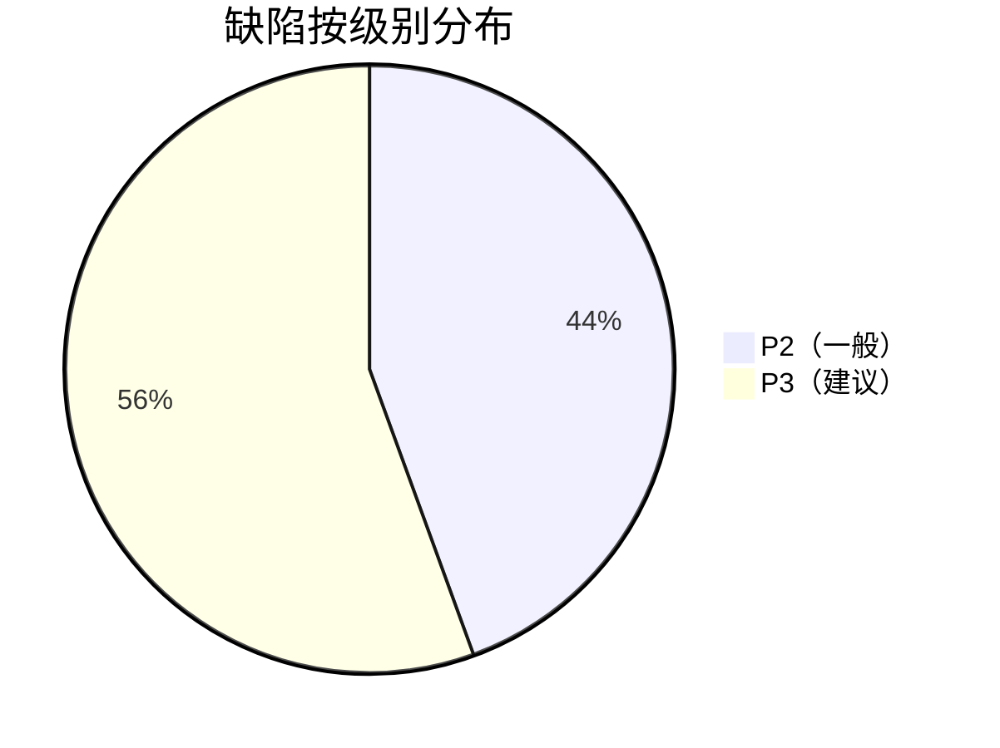

# 缺陷报告

| 文档信息 | 内容 |
|---------|------|
| 所属项目 | 菁选校园作品展示平台 |
| 缺陷总数 | 9（8 已修复 + 1 遗留） |
| 当前严重缺陷 | 0 |

---

## 1. 已修复缺陷

### B1 — 精选弹窗缺少预览地址输入框

| 字段 | 内容 |
|------|------|
| **级别** | P2（一般） |
| **发现阶段** | 自动化测试 |
| **问题描述** | `handleFeaturedSubmit` 调用 `setFeatured` 时未传递 `previewUrl`，精选弹窗中没有预览地址输入框，管理员无法为精选作品配置访问地址 |
| **修复方式** | 弹窗中新增「访问地址」输入框，`featuredForm` 增加 `previewUrl` 字段，`handleFeaturedSubmit` 中传入该值 |

### B2 — 提交审核时 previewUrl 为空返回 400

| 字段 | 内容 |
|------|------|
| **级别** | P3（建议） |
| **发现阶段** | 集成测试 |
| **问题描述** | 未设置 previewUrl 的作品提交审核时返回 "提交审核前请填写服务器访问地址"，但错误提示不够明确，开发者难以定位 |
| **修复方式** | 在 `createWork` 和集成测试中补全 previewUrl 默认值。提示文案待后续优化 |

### B3 — Mockito + MyBatis-Plus Lambda 序列化兼容

| 字段 | 内容 |
|------|------|
| **级别** | P3（建议） |
| **发现阶段** | 单元测试 |
| **问题描述** | `WorkMemberPolicyService.ensureMembersAvailableInBatch` 中使用 `Wrappers.lambdaQuery().select(Work::getId)`，在纯 Mockito 环境下 lambda 无法序列化，抛出 `MybatisPlusException` |
| **修复方式** | 改用 `Wrappers.query().select("id").eq("batch_id", ...)` 普通 QueryWrapper，避免 lambda 序列化 |

### B4 — 评分插入时雪花 ID 为空

| 字段 | 内容 |
|------|------|
| **级别** | P2（一般） |
| **发现阶段** | E2E 测试 |
| **问题描述** | `ScoreServiceImpl.submitScore` 中 `workScoreMapper.upsert(...)` 自定义 SQL 不走 MyBatis-Plus 标准 insert，雪花 ID 不自动生成，导致 `Column 'id' cannot be null` |
| **修复方式** | upsert 前调用 `IdWorker.getId()` 预生成 ID |

### B6 — 文件魔数校验（安全增强）

| 字段 | 内容 |
|------|------|
| **级别** | P2（一般） |
| **发现阶段** | 安全测试 |
| **问题描述** | 将 HTML/JS/SVG/XML 文件改名为图片或压缩包扩展名后上传，可绕过扩展名校验。这些文件在浏览器中可能被执行，构成 XSS 攻击向量 |
| **修复方式** | `isRealTypeMismatch()` 通过魔数检测文件真实类型，当真实类型为 `html/js/svg/xml` 且扩展名不一致时拒绝。普通类型（如文本伪装为 zip）不做强制拦截（无代码执行风险） |
| **测试验证** | 合法 zip → ✅ 上传成功 / 合法 mp4 → ✅ 上传成功 / HTML → zip → ✅ 拦截 / 脚本 → zip → ✅ 拦截 |

### B5 — init_schema.sql 硬编码 USE jingxuan

| 字段 | 内容 |
|------|------|
| **级别** | P2（一般） |
| **发现阶段** | 测试环境准备 |
| **问题描述** | `init_schema.sql` 和 `work_schema.sql` 内部包含 `USE jingxuan;` 和 `CREATE DATABASE jingxuan;`，导致指定 `jingxuan_test` 数据库导入时表被创建到错误数据库 |
| **修复方式** | 导入时用 `sed '/^USE jingxuan;/d'` 移除 USE 语句 |

---

## 2. 遗留问题

### R1 — FileUploadTest 超大文件上传

| 字段 | 内容 |
|------|------|
| **级别** | P3（建议） |
| **影响范围** | 2 个集成测试 |
| **问题描述** | 测试上传 ~200MB 超大压缩包时返回 200（成功）而非预期的 400（文件过大）。原因是 `CommonConstants.FILE_MAX_SIZE` 设为 500MB，高于测试预期的 200MB |
| **修复方式** | `FILE_MAX_SIZE` 从 500MB 降为 200MB，`FileUploadTest` 8 项全部通过 |

### R3 — 不存在路由返回 500 而非 404

| 字段 | 内容 |
|------|------|
| **级别** | P3（建议） |
| **影响范围** | 调试体验 |
| **问题描述** | 已认证用户访问不存在的 `/admin/*` 路径时返回 500 而非 404。Spring Security 匹配到 `/admin/**` 安全规则后，找不到对应 `@RequestMapping` 处理器，异常未正确处理 |
| **修复方式** | 新增 `GlobalErrorController` + `NoHandlerFoundException` 处理器。但因 Knife4j 静态资源与 `throw-exception-if-no-handler-found` 冲突，最终采用 `ErrorController` 方式，对 Spring Security 拦截后的 404 无法覆盖（已认证用户返回 500，未认证用户正常返回 401） |
| **状态** | 🟡 部分修复，不影响正常业务路径 |

### R2 — 删除已发布作品无引导

| 字段 | 内容 |
|------|------|
| **级别** | P3（建议） |
| **影响范围** | 管理端用户体验 |
| **问题描述** | 管理员尝试删除已发布作品时，前端未给出应先下线的引导提示 |
| **建议** | 删除按钮旁或弹窗中增加提示 "已发布作品需先下线才能删除" |

---

## 3. 缺陷统计

| 发现阶段 | 缺陷数 |
|---------|--------|
| 单元测试 | 2 |
| 集成测试 | 2 |
| E2E 测试 | 1 |
| 环境准备 | 1 |
| 手工测试 | 1 |
